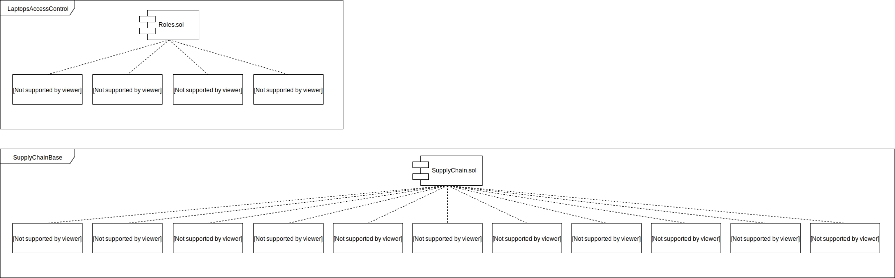

# Architect a Blockchain Supply Chain Solution
A project to architect a supply chain management blockchain solution using UML diagrams

## Problem statement
Once you’ve decided on a supply chain industry, let’s begin planning. Create the UML diagrams to scope out the behaviors and structures your solution will need to track for part b of the project.

## You will need to submit the following UML diagrams:
- Activity
- Sequence
- State
- Classes (Data Model)

## Class Diagram
<a href="https://www.w3schools.com">Visit W3Schools.com!</a>

